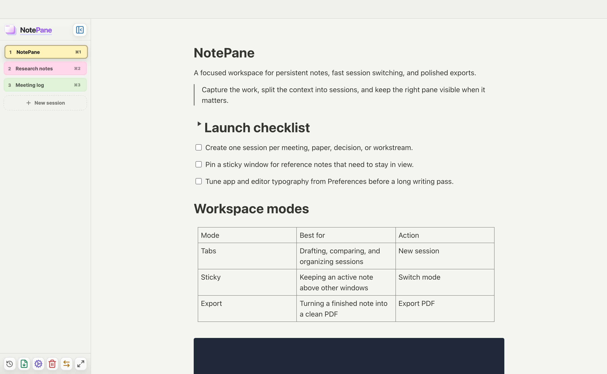
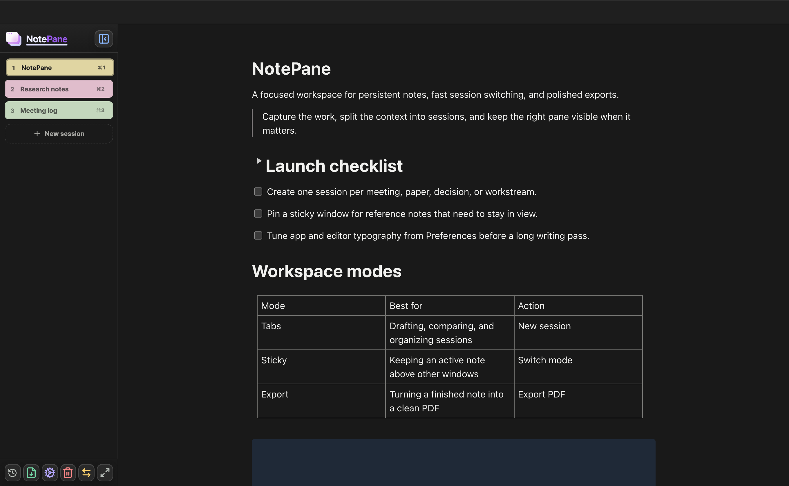
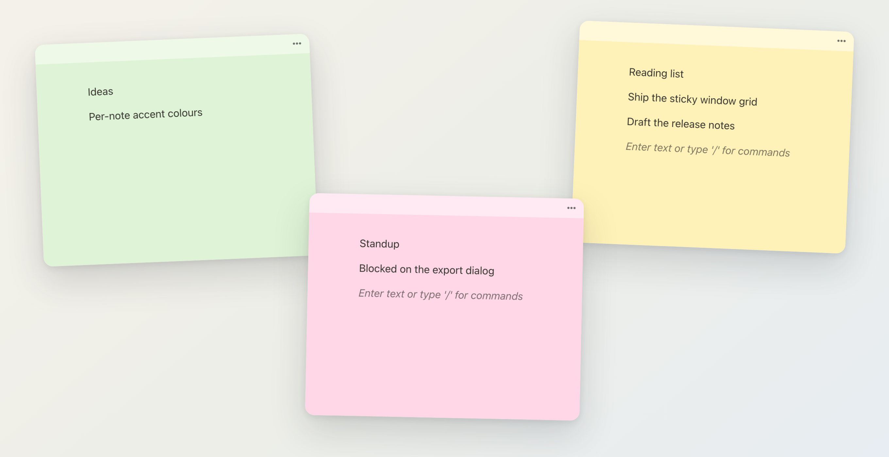
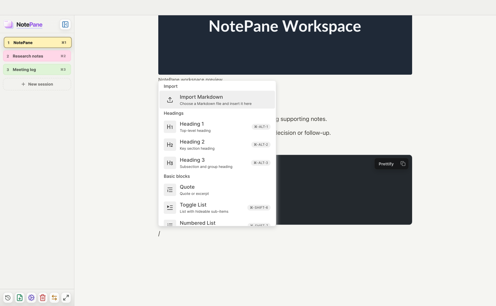

<div align="center">


# NotePane

**A block-based desktop note app that can spread out.**

Write in a Notion-style block editor, keep every note in one tidy window,
then scatter them across your desktop as pastel sticky windows when you need
them in view. Local-first, no account, no sync service.

macOS · Windows · built with [Electron](https://www.electronjs.org/) and [BlockNote](https://www.blocknotejs.org/)

</div>

<div align="center">
  
</div>

---

## Why NotePane

Most note apps make you choose. Either everything lives in one window and
disappears the moment you switch away, or every note is a floating scrap with
no structure and no real editor.

NotePane does both, and switches between them with one shortcut.

- **A real block editor.** BlockNote gives you the `/` command palette,
  drag handles, nesting, tables, toggles and code blocks. Its default UI is
  used as-is rather than wrapped in a custom toolbar, so it behaves the way
  you already expect.
- **Two shapes for the same notes.** Gather them into a sidebar, or spread
  them across the screen. Nothing is duplicated or exported between modes.
- **Yours, on your disk.** Notes are a plain JSON file in your user data
  directory. No sign-in, no server, no telemetry.

---

## Two modes

### Tab sessions mode

One window. Sessions live in the sidebar, each with its own accent colour and
a `⌘1`–`⌘9` shortcut. This is where you draft, compare and organise.

<div align="center">
  
</div>

### Sticky windows mode

Every session becomes its own small window, arranged across your display and
tinted with its accent colour. Pin the ones you want above other apps and keep
working elsewhere.

<div align="center">
  
</div>

Press `⌘⇧T` to move between them. Drag a sidebar tab out of the window to
detach a single note; drop a detached note back to dock it again.

---

## The editor

<div align="center">
  
</div>

Type `/` anywhere to insert a block. Available blocks:

| | |
| --- | --- |
| **Text** | Paragraph, Heading 1–3, Toggle Heading, Quote |
| **Lists** | Bullet, Numbered, Check, Toggle |
| **Structure** | Table with advanced handles, Code block with syntax highlighting and a prettifier |
| **Media** | Image with download and crop, File, Video, Audio |

Plus inline styles, links, per-note typography, a table of contents rail, and
Markdown import straight from the slash menu.

---

## Install

### Run a packaged app

```bash
git clone https://github.com/Extransload/NotePane.git
cd NotePane
make install
make app
```

The installer or archive lands in `release/`. `make app` builds for the
machine you are on; `make app-mac` produces a macOS arm64 zip and
`make app-win` a Windows x64 installer.

### Run from source

```bash
make install
make run
```

`make run` builds the renderer and opens the desktop app. On WSL it produces a
Windows app folder and launches `NotePane.exe` for you.

**Requirements:** Node `^20.19` or `>=22.12`, and npm. `make install` also
downloads the Chromium build used by the test suite. Without `make`, the
equivalent is `npm install && npm run install:browsers && npm start`.

### Develop

```bash
make dev-web    # Vite dev server on 127.0.0.1:5173
make dev-app    # Electron against that server, in a second terminal
```

---

## Everyday use

Create a session, write, and switch. Sessions are titled automatically from
their first line until you rename one by double-clicking its tab.

| Shortcut | Action |
| --- | --- |
| `⌘T` / `⌘N` | New session |
| `⌘1` … `⌘9` | Jump to a session |
| `⌘⇧T` | Switch between Tab sessions mode and Sticky windows mode |
| `/` | Open the block palette |
| `⌘,` | Preferences |
| `⌘⇧E` | Export as PNG or PDF |

These are the default macOS shortcuts (`⌘` = Command, `⇧` = Shift).
On Windows, use Ctrl instead of Command.
See the [usage guide](docs/usage.md) for more shortcuts and appearance settings.

---

## Where your notes live

A single JSON file in Electron's `userData` directory:

```text
macOS     ~/Library/Application Support/NotePane/notes.json
Windows   %APPDATA%\NotePane\notes.json
```

It holds the BlockNote document, a Markdown fallback, window bounds, colours
and typography for every note. Preferences include a full backup export and
import, so moving to another machine is a file copy.

---

## Contributing

```bash
npm run check:refs   # undefined references, about a second
npm run verify:quick # build, unit tests, distribution checks
npm run verify       # everything above plus both end-to-end suites
```

`docs/architecture.md` has a code map naming the file that owns each kind of
behaviour, and `AGENTS.md` describes how much verification a change needs.
Renderer code is grouped by ownership:

```text
src/editor/   editor engine and behaviour
src/model/    stored data and its normalisation
src/style/    colour maths and computed styles
src/ui/       React components
src/hooks/    stateful behaviour lifted out of the editor shell
src/utils/    small shared helpers
```

Tests live in `tests/e2e/renderer/` by feature, `tests/e2e/electron.spec.mjs`
for desktop behaviour, and `tests/unit/` for the store.

---

## Not included

AI, comments, real-time collaboration and DOCX/ODT export are not currently
provided. NotePane focuses on local note-taking.

---

## License

NotePane is licensed under the [MIT License](LICENSE).
Third-party dependencies remain subject to their respective licenses.
